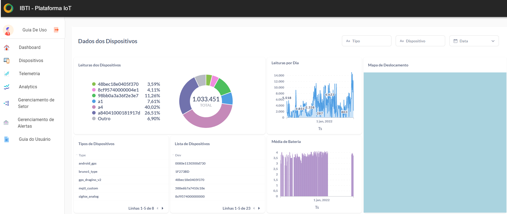

Analytics
===================

Analytics é um iframe do servidor Metabase onde traz dados que foram enviados diretamente para a plataforma, usando filtros como: tipo, dispositivo e dados.

Filtrando as informações dentro do Analytics 
--------------------------------------------------