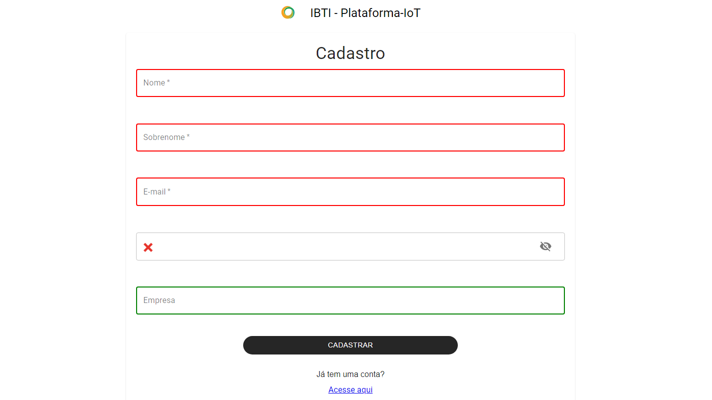
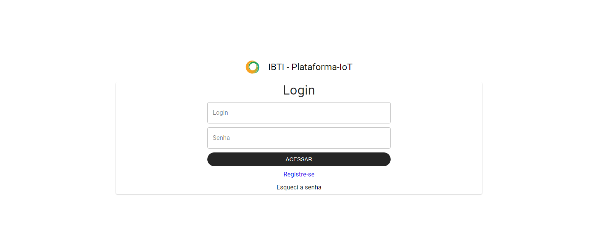
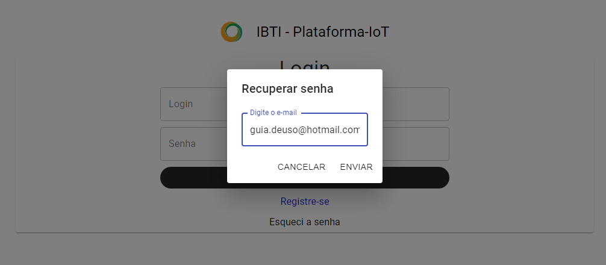
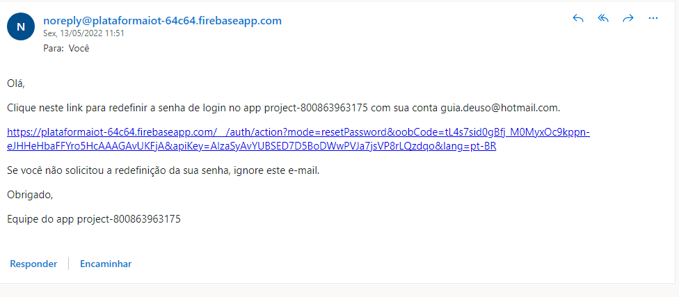
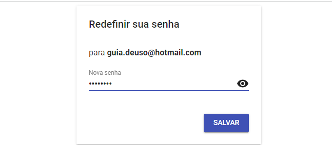

Como acessar a plataforma ?
==============================

Para entrar na plataforma, o usuário deve primeiro acessar o endereço eletrônico  onde a plataforma 
está disponibilizada e fazer o login com suas credenciais, caso ainda não possua cadastro deverá clicar 
em registra-se e inserir seus dados de usuário nos campos indicados, conforme mostrado na figura abaixo.

Para realizar o cadastro na plataforma é necessário inserir as seguintes informações: 

- Nome
- Sobrenome 
- E-mail 
- Senha 
- Empresa 

.. note::
 A senha deve ter pelo menos 8 caracteres que necessitam incluir letras (maiúsculas e minúsculas), números e caracteres especiais, recomenda-se também que seja simples de digitar e, o mais importante, deve ser fácil de lembrar.

Para logar na plataforma é necessário introduzir as credenciais de acesso criadas durante o registo:

- E-mail 
- Senha 

.. attention::
  Caso o sistema não reconheça o login irá mostrar a mensagem "E-mail não cadastrado.” Ou caso não reconheça a senha do usuário, irá mostrar a mensagem “Senha inválida”. 

Recuperando a senha
----------------------

A única coisa que você precisa para recuperar sua senha é o endereço de e-mail que você usou para cadastrar-se na plataforma anteriormente. 

Passo 01. Vá para a página de login. Abaixo do campo de e-mail, clique em  "Esqueci a senha".

Passo 02. Preencha o campo com o e-mail cadastrado e clique em enviar. 

Passo 03. Abra o e-mail e clique no link enviado (confira na caixa de spam caso não esteja na caixa de entrada).

Passo 04. Defina a nova senha e finalize a recuperação da sua conta clicando em “save”.

