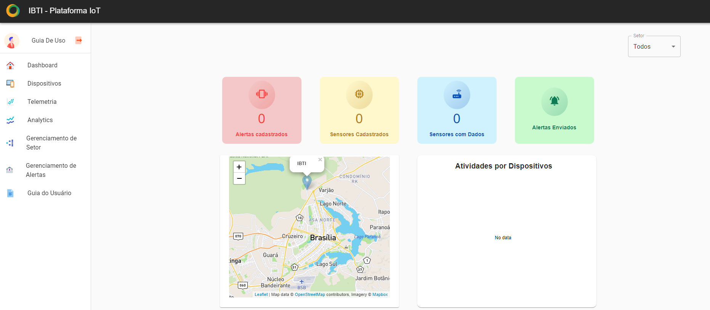
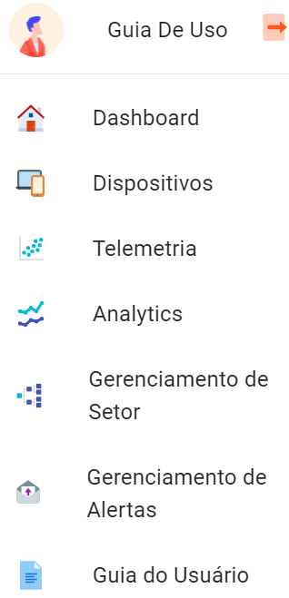

Estrutura da plataforma
=============================

A estrutura da plataforma está organizada de forma a simplificar a visualização das informações e facilitar a execução das tarefas do usuário. 

A página encontra-se dividida em duas secções principais:

- **Menu Lateral** - Situa-se do lado esquerdo da página, por baixo do logotipo, e está sempre visível ao utilizador. Ele traz as funções de controle do sistema: dashboard, dispositivos, telemetria, analytics, gerenciamento de setores e gerenciamento de alertas.
- **Dashboard** - Local onde todas as informações são apresentadas. Os dados exibidos nesta seção mudam dependendo das informações e dispositivos selecionados.

Após o processo de autenticação, inicia-se a utilização da plataforma onde é apresentado a tela home que dispõe os dados dos dispositivos quando existentes e o menu lateral que leva as seguintes páginas/telas: 

**Dashboard:** Apresenta o dashboard e uma visão geral do sistema da plataforma.

**Dispositivos:** Possibilita o cadastro, a edição e a exclusão dos dispositivos.

**Telemetria:** Apresenta as métricas dos dispositivos.

**Analytics:** Mostra graficamente as análises dos dados.

**Gerenciamento de Setor:** Onde é realizado o cadastro e gerenciamento dos setores.

**Gerenciamento de Alertas:** Possibilita o cadastro de mensagens e o gerenciamento de alertas.
