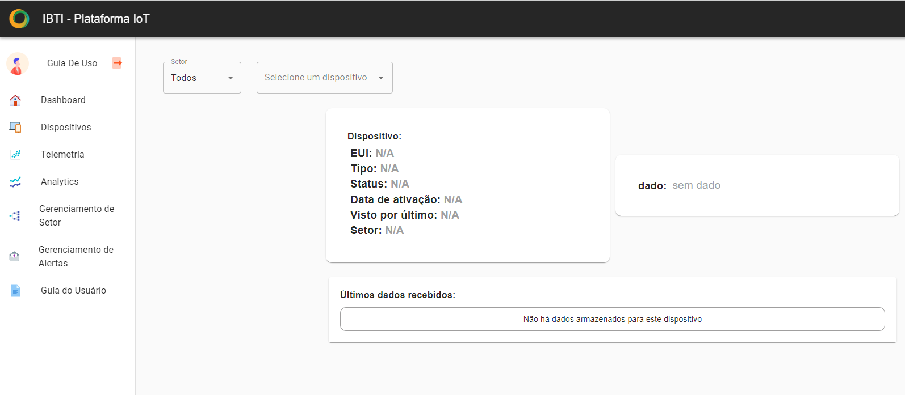

Telemetria
===================

Na telemetria é possível monitorar os dados de um dispositivo específico, selecionando-o através de uma combobox e, além de poder observar sua localização e acompanhar o gráfico, também é possível ver os dados mais recentes recebidos através da tabela.

